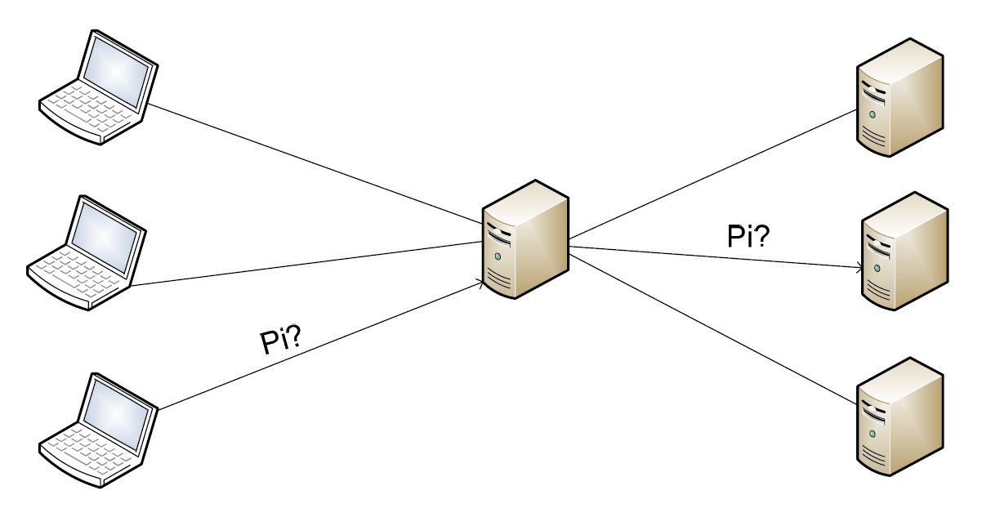
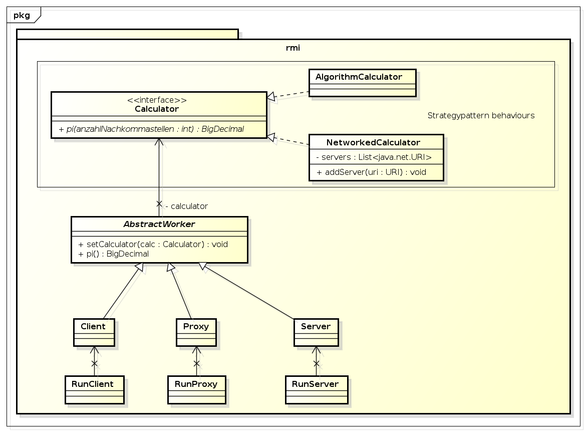

#########################
Distributed-PI-Calculator
#########################
================
Aufgabenstellung
================

Als Dienst soll hier die beliebig genaue Bestimmung von pi betrachtet werden.
Der Dienst stellt folgendes Interface bereit:

.. code:: java

    // Calculator.java
    public interface Calculator {
        public BigDecimal pi (int anzahl_nachkommastellen);
    }

Ihre Aufgabe ist es nun, zunächst mittels Java-RMI die direkte Kommunikation
zwischen Klient und Dienst zu ermöglichen und in einem zweiten Schritt den
Balancierer zu implementieren und zwischen Klient(en) und Dienst(e) zu
schalten. Gehen Sie dazu folgendermassen vor:

1. Ändern Sie Calculator und CalculatorImpl so, dass sie über Java-RMI von
   aussen zugreifbar sind. Entwicklen Sie ein Serverprogramm, das eine
   CalculatorImpl-Instanz erzeugt und beim RMI-Namensdienst registriert.
   Entwicklen Sie ein Klientenprogramm, das eine Referenz auf das
   Calculator-Objekt beim Namensdienst erfragt und damit pi bestimmt. Testen
   Sie die neu entwickelten Komponenten.

2. Implementieren Sie nun den Balancierer, indem Sie eine Klasse
   CalculatorBalancer von Calculator ableiten und die Methode pi() entsprechend
   implementieren. Dadurch verhält sich der Balancierer aus Sicht der Klienten
   genauso wie der Server, d.h. das Klientenprogramm muss nicht verändert
   werden. Entwickeln Sie ein Balanciererprogramm, das eine
   CalculatorBalancer-Instanz erzeugt und unter dem vom Klienten erwarteten
   Namen beim Namensdienst registriert. Hier ein paar Details und Hinweise:

   - Da mehrere Serverprogramme gleichzeitig gestartet werden, sollten Sie das
     Serverprogramm so erweitern, dass man beim Start auf der Kommandozeile den
     Namen angeben kann, unter dem das CalculatorImpl-Objekt beim Namensdienst
     registriert wird. dieses nun seine exportierte Instanz an den Balancierer
     übergibt, ohne es in die Registry zu schreiben. Verwenden Sie dabei ein
     eigenes Interface des Balancers, welches in die Registry gebinded wird,
     um den Servern das Anmelden zu ermöglichen.

   - Das Balancierer-Programm sollte nun den Namensdienst in festgelegten
     Abständen abfragen um herauszufinden, ob neue Server Implementierungen zur
     Verfügung stehen.

   - Java-RMI verwendet intern mehrere Threads, um gleichzeitig eintreffende
     Methodenaufrufe parallel abarbeiten zu können. Das ist einerseits von
     Vorteil, da der Balancierer dadurch mehrere eintreffende Aufrufe parallel
     bearbeiten kann, andererseits müssen dadurch im Balancierer änderbare
     Objekte durch Verwendung von synchronized vor dem gleichzeitigen Zugriff
     in mehreren Threads geschützt werden.

   - Beachten Sie, dass nach dem Starten eines Servers eine gewisse Zeit
     vergeht, bis der Server das CalculatorImpl-Objekt erzeugt und beim
     Namensdienst registriert hat sich beim Balancer meldet. D.h. Sie müssen im
     Balancierer zwischen Start eines Servers und Abfragen des Namensdienstes
     einige Sekunden warten.

Testen Sie das entwickelte System, indem Sie den Balancierer mit verschiedenen
Serverpoolgrössen starten und mehrere Klienten gleichzeitig Anfragen stellen
lassen. Wählen Sie die Anzahl der Iterationen bei der Berechung von pi
entsprechend gross, sodass eine Anfrage lang genug dauert um feststellen zu
können, dass der Balancierer tatsächlich mehrere Anfragen parallel bearbeitet.

~~~~~~~~~~~~~
Gruppenarbeit
~~~~~~~~~~~~~
Die Arbeit ist als 2er-Gruppe zu lösen und über das Netzwerk zu testen! Nur
localhost bzw. lokale Testzyklen sind unzulässig und werden mit 6 Minuspunkten
benotet!

~~~~~~~~~~~~~~~~~~
Benotungskriterien
~~~~~~~~~~~~~~~~~~
- 12 Punkte: Java RMI Implementierung (siehe Punkt 1)
- 12 Punkte: Implementierung des Balancers (siehe Punkt 2)
- davon 6 Punkte: Balancer
- davon 2 Punkte: Parameter - Name des Objekts
- davon 2 Punkte: Listing der Server (dyn. Hinzufügen und Entfernen)
- davon 2 Punkte: Testprotokoll mit sinnvollen Werten für Serverpoolgröße und
  Iterationen

~~~~~~~
Quellen
~~~~~~~
An Overview of RMI Applications, Oracle Online Resource,

http://docs.oracle.com/javase/tutorial/rmi/overview.html (last viewed 03.12.2013)

=======
Planung
=======
~~~~~~~~~~~~~~~~~
Aufwandsschätzung
~~~~~~~~~~~~~~~~~
+-----------------------------------+---------------+-------------+-----------+
| Task                              | Planned Time  | Effort      | Who       |
|                                   +---------------+-------------+-----------+
|                                   |     [H:MM]    |             | [name]    |
+===================================+===============+=============+===========+
| RMI einlesen                      |      1:30     |    Hoch     | aayvazyan |
|                                   |               |             | jklepp    |
+-----------------------------------+---------------+-------------+-----------+
| UML                               |      1:00     |   Gering    | jklepp    |
+-----------------------------------+---------------+-------------+-----------+
| Ant build file                    |      0:30     |   Gering    | jklepp    |
+-----------------------------------+---------------+-------------+-----------+
| JUnit tests                       |      1:30     |   Gering    | jklepp    |
+-----------------------------------+---------------+-------------+-----------+
| Programmierung d Behaviours       |      2:00     |    Hoch     | aayvazyan |
+-----------------------------------+---------------+-------------+-----------+
| Sonstiger Code                    |      1:00     |   Mittel    | aayvazyan |
+-----------------------------------+---------------+-------------+-----------+
| manuelle Tests                    |      0:20     |   Gering    | aayvazyan |
|                                   |               |             | jklepp    |
+-----------------------------------+---------------+-------------+-----------+
| Dokumentation                     |      1:20     |   Mittel    | jklepp    |
+-----------------------------------+---------------+-------------+-----------+

~~~~~~~~~~~~~~~
Klassendiagramm
~~~~~~~~~~~~~~~

=========
Umsetzung
=========
=====
Tests
=====
~~~~~~
Client
~~~~~~
~~~~~
Proxy
~~~~~
~~~~~~
Server
~~~~~~
~~~~~~~~~~~
JUnit tests
~~~~~~~~~~~

.. code:: text

================
Zeitaufzeichnung
================
+----------------------------+-----------+--------------+---------+---------+-----------+
| Task                       | Who?      | Date         | From    | To      | Duration  |
|                            +-----------+--------------+---------+---------+-----------+
|                            | [name]    | [YYYY-MM-DD] | [HH:MM] | [HH:MM] |    [H:MM] |
+============================+===========+==============+=========+=========+===========+
| RMI Tutorial lesen         | jklepp    |  2013-11-29  |  16:20  |  17:00  |     0:40  |
|                            | aayvazyan |              |         |         |           |
+----------------------------+-----------+--------------+---------+---------+-----------+
| UML Session 1              | jklepp    |  2013-11-29  |  17:00  |  17:30  |     0:30  |
|                            | aayvazyan |              |         |         |           |
+----------------------------+-----------+--------------+---------+---------+-----------+
| Vorbereitung Dokument      | jklepp    |  2013-12-03  |  20:00  |  20:35  |     0:35  |
+----------------------------+-----------+--------------+---------+---------+-----------+
| UML                        | jklepp    |  2013-12-03  |  21:15  |  22:00  |     0:45  |
+----------------------------+-----------+--------------+---------+---------+-----------+
| JUnit Test stubs           | jklepp    |  2013-12-03  |  22:10  |  22:30  |     0:20  |
+----------------------------+-----------+--------------+---------+---------+-----------+
| Ant build file anpassen    | jklepp    |  2013-12-04  |  15:30  |  16:00  |     0:30  |
+----------------------------+-----------+--------------+---------+---------+-----------+
| JUnit Tests                | jklepp    |  2013-12-04  |  16:25  |  16:40  |     0:30  |
| AlgorithmCalculator        |           |              |         |         |           |
+----------------------------+-----------+--------------+---------+---------+-----------+
| JUnit Tests                | jklepp    |  2013-12-04  |  16:25  |  16:40  |     1:00  |
| vorläufig fertiggestellt   |           |              |         |         |           |
+----------------------------+-----------+--------------+---------+---------+-----------+
| Server/Proxy Code          | jklepp    |  2013-12-04  |  19:00  |  19:25  |     0:25  |
+----------------------------+-----------+--------------+---------+---------+-----------+
| NetworkCalculator Code     | jklepp    |  2013-12-04  |  19:25  |  19:50  |     0:25  |
+----------------------------+-----------+--------------+---------+---------+-----------+
| JUnit Test verbesserungen  | jklepp    |  2013-12-04  |  19:50  |  20:00  |     0:10  |
+----------------------------+-----------+--------------+---------+---------+-----------+

.. header::

    +-------------+---------------+------------+
    | Titel       | Autor         | Datum      |
    +=============+===============+============+
    | ###Title### | Ari Ayvazyan  | 04.12.2013 |
    |             | & Jakob Klepp |            |
    +-------------+---------------+------------+

.. footer::

    ###Page### / ###Total###
